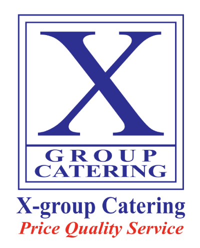

# X-Group Catering & Convention



## 🍽️ Overview

**X-Group Catering & Convention** is a premium web application representing Dhaka's premier event management and catering service. Built with **Next.js 16**, **TypeScript**, and **Tailwind CSS**, this platform showcases architectural grandeur and culinary excellence, offering users an immersive experience to explore venues, browse extensive menus, and book events.

This project emphasizes a **mobile-first**, **high-performance**, and **aesthetically rich** design, featuring smooth animations, glassmorphism effects, and a centralized content management system.

## ✨ Key Features

- **immersive 3D Hero Section**: A stunning entry point with parallax effects and floating 3D cards.
- **Dynamic Menu System**: A comprehensive, tab-based menu browsing experience (À La Carte, Set Menus, Buffet Packages) with category filtering and sticky navigation.
- **Venue Showcase**: Detailed presentations of convention halls (Shimanto, Zam Zam) with capacity, configuration details, and high-quality imagery.
- **Centralized Content Management**: All site data (menus, venues, contact info, social links) is managed via a single `src/lib/constants.ts` file for easy updates.
- **Responsive Design**: Fully optimized for all devices, from large desktop screens to mobile phones.
- **Smart Navigation**: Sticky headers, smooth scrolling, and an intuitive mobile menu.
- **Booking System**: Integrated booking forms for event reservations.
- **Performance Optimized**: Utilizes Next.js App Router, optimized images (`next/image`), and efficient component rendering.

## 🛠️ Tech Stack

- **Framework**: [Next.js 16](https://nextjs.org/) (App Router)
- **Language**: [TypeScript](https://www.typescriptlang.org/)
- **Styling**: [Tailwind CSS v4](https://tailwindcss.com/)
- **Icons**: [Lucide React](https://lucide.dev/)
- **Animations**: Custom CSS animations (Fade-in, Float, Pulse, Scale-in)
- **Package Manager**: npm

## 🚀 Getting Started

Follow these steps to set up the project locally.

### Prerequisites

- Node.js 18.17 or later
- npm

### Installation

1.  **Clone the repository**

    ```bash
    git clone https://github.com/AJAmran/catering-x-group.git
    cd x-group-catering-nextjs
    ```

2.  **Install dependencies**

    ```bash
    npm install
    # or
    npm i
    ```

3.  **Run the development server**

    ```bash
    npm run dev
    ```

4.  **Open the app**
    Open [http://localhost:3000](http://localhost:3000) in your browser to view the application.

## 📂 Project Structure

```bash
src/
├── app/                  # Next.js App Router pages and layouts
│   ├── about/            # About Us page
│   ├── book-hall/        # Booking page
│   ├── contact/          # Contact page
│   ├── gallery/          # Image Gallery
│   ├── halls/            # Venues listing
│   ├── menu/             # Menu explorer
│   ├── layout.tsx        # Root layout (Header, Footer, ScrollToTop)
│   └── page.tsx          # Homepage
├── components/           # Reusable UI components
│   ├── UI.tsx            # Core UI primitives (Container, Section, Button, etc.)
│   ├── Header.tsx        # Global Navigation
│   ├── Footer.tsx        # Site Footer
│   ├── ScrollToTop.tsx   # Scroll to top utility
│   └── ...
├── lib/                  # Utilities and Constants
│   ├── constants.ts      # Centralized Site Data (Menus, Info, Links)
│   └── types.ts          # TypeScript Definitions
└── styles/               # Global styles
```

## 🔧 Scripts

- `npm run dev`: Starts the development server.
- `npm run build`: Builds the application for production.
- `npm run start`: Starts the production server.
- `npm run lint`: Runs ESLint to check for code quality issues.

## 🎨 Customization

### Content Updates

You can update almost all textual content, menu items, venue details, and links by editing **`src/lib/constants.ts`**. This file acts as a headless CMS for the application.

### Theming

The visual theme is defined in **`src/app/globals.css`** using Tailwind CSS v4 CSS variables. You can adjust colors (`--color-convention`, `--color-catering`, etc.) and fonts there.

## 📄 License

This project is proprietary software belonging to **X-Group Chain Restaurant & Hospitality Management**.

---

Developed with ❤️ by the X-Group Tech Tea